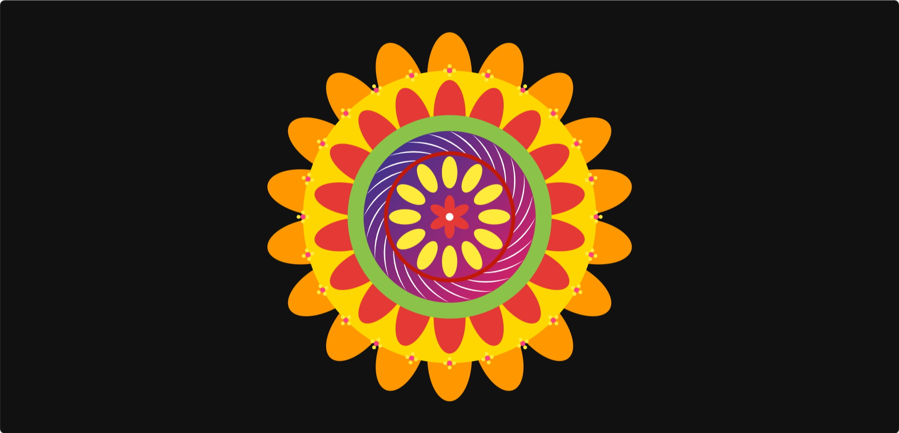

# Code-A-Pookalam 🌸
Welcome to CODE-A-പൂക്കളം, a creative coding challenge scheduled from September 1–6, where tradition meets technology! 🌼

### Your Details
- [Gowri C Karthik] - [Computer Science] - [S1]

### Hosted Pookalam Link
https://gowrickarthik-07.github.io/Code-A-Pookalam/

### Pookalam Description
My aim was to build a realistic pookalam. This is basically a cute flower themed pookalam. I gave a flower with red petals in the middle and also stripes in the second layer which makes it attractive. I also included tiny flowers  with detailings  in the outermost circle which became my personal favourite part in this pookalam and i believe that it made the pookalam complete and special. 

### Technologies Used 
HTML
SVG
VS Code
Git & GitHub

### Video explaining How you build the pookalam

### Screenshots

Happy Onam !  
Made with ❤️ at TinkerHub LBSITW

